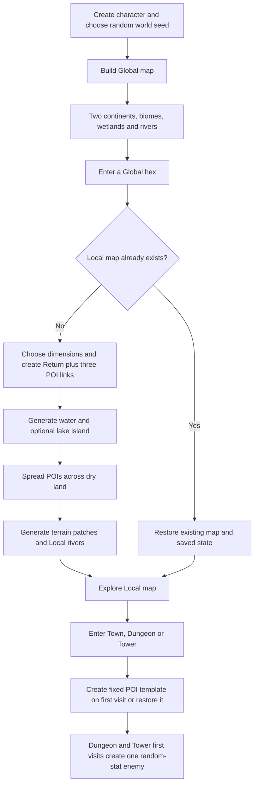

# How the Game Is Generated Now
Updated: 2026-09-11
Checkpoint: [UI Foundation]+[Documentation]+[GenerationReference]
Implementation baseline/evidence: current Workshop Prototype, including LocalPoiSpacing; generation, actor, item and map-transition code inspected on this date. This describes the Workshop F6 build, not a fresh audit of Production.

## Actor Foundation Update

The new [Actor Foundation scene](../Actor%20Foundation/README.md) reuses the geography and initial content described below, but replaces actor runtime behavior. It keeps multiple persistent actors instead of one enemy snapshot per map; enemies can inspect/pick up/equip gear and use shared action rules; observed exits can be followed across maps. It advances world turns on travel, waiting and out-of-combat movement/paid interactions. Static player/goblin sprites replace block actors. [Actor current state](../Actor%20Foundation/CURRENT_STATE.md) owns the exact rules and limitations.

The original UI Foundation scene still behaves as described below. Neither scene adds random Local enemy populations or random ground-loot placement; Dungeon/Tower first visits still create one resident enemy. Pursuers can subsequently join residents in Actor Foundation.

## The Overall Flow

The game creates a seeded world first, then creates smaller maps as you enter them. Geography and POI placement are procedural. Dungeon interiors and encounter placement are still simple fixed templates. Enemy stats and equipment are random, but enemies and loose loot are not scattered throughout the world.

## 1. Starting a Run

The character is created from the six stat values assigned during character creation. Starting equipment is rolled when the actor is created. A new random world seed between 1 and 2,147,480,000 is then chosen, and the Global map is built. The player begins on a Plains cell on the first continent, with no active enemy, no ground loot and combat off.

The world seed controls geography, Local sizes and POI positions. It does **not** reproduce an entire playthrough: character equipment, enemy stats and enemy equipment use the general random-number stream. In fact, the character's equipment is created before the world seed is chosen.

Starting another run creates a new world and discards the previous run's map/state dictionaries. There is no disk save/load system.

## 2. The Global Map

The Global grid is **80 columns × 42 rows**. Rows 0 and 41 are blocked Ice Wall cells, leaving 80×40 = **3,200 playable cells**. East and west wrap around; north and south do not. Sea is currently traversable, so “playable” includes ocean.

The continent generator builds exactly two continental templates. Each has a central land mass and four offset lobes joined by narrow land corridors. Seeded noise roughens their coastlines. Their centers are separated around the horizontally wrapped world, and width limits preserve ocean between them. Connected-component filtering keeps each continent's connected core and discards detached offshore pieces. This is a procedural shape recipe, not tectonics or erosion. Offshore island generation is not implemented.

Elevation, moisture and temperature noise are sampled around a cylinder so the fields meet across the horizontal seam. The land mask determines the continental footprint; land elevation is clamped above the Sea classification cutoff, so the classifier does not cut additional sea cells through the retained land mass.

### Global Biomes

The classifier applies these rules in order to land cells:

| Condition | Result |
|---|---|
| Elevation above 0.38 | Mountains |
| Otherwise elevation above 0.18 | Hills |
| Otherwise moisture above 0.32 and elevation below -0.06 | Lakes |
| Otherwise moisture below -0.18 | Desert when warmth is above zero; Wasteland otherwise |
| Otherwise moisture above 0.06 | Forest |
| Otherwise | Plains |

Sea initially fills the area outside the continents. The general classifier also has an elevation-below--0.28 Sea rule, but the active continent generator clamps its land inputs above that threshold. The standalone `biome_generator.generate()` function is not the current Global construction entry point.

Wetlands are then assigned from a snapshot of these base biomes, so one wetland conversion does not trigger another:

- Plains with at least four Sea neighbors becomes Salt Marsh.
- Other Plains touching Sea or Lakes becomes Marsh.
- Forest touching Sea or Lakes becomes Swamp.

Salt Marsh is a land/wetland biome, not ocean. Finally, the player's starting cell is forced to Plains. Biome coverage varies by seed; every seed is not promised every biome.

Every walkable Global cell gets a lightweight link describing its future Local map. Those Local maps are not built yet.

## 3. Creating a Local Region

A Local map is generated the first time its Global cell is entered. Its identity includes that Global cell's coordinates. A random generator seeded from the world seed and Local identity chooses one of these width×height pairs:

**30×20, 33×22, 36×24, 39×26, 42×28 or 45×30.**

The Local map inherits its parent Global biome as its regional identity. It always begins with one Return link, one Dungeon link, one Town link and one Tower link. Generation then runs in this exact order:

1. Water and optional lake island.
2. Final POI spacing on the resulting dry land.
3. Per-cell terrain patches and elevation.
4. Rivers.

Local generation depends on the world seed and map identity, not the order in which regions are visited. Neighboring Local regions are generated independently; their detailed coastlines and terrain patches are not stitched together across borders.

### Water Shapes

| Regional biome | Water construction |
|---|---|
| Lakes | Mostly central elliptical basin with noise-distorted shore; retain the center-connected body |
| Sea | Broad coast with seeded orientation and irregular shoreline |
| Salt Marsh | More broken coastal mask |
| Marsh / Swamp | Clustered pools selected from noise, with different thresholds |
| Other biomes | No Local water mask from this generator |

Lakes have a **65% seeded chance** of a small off-center island. If created, the Tower moves onto it and is marked as an island destination. Lake entrance cells are kept dry. Other watery regions keep Return and a small neighboring patch dry and move any initially submerged POIs onto available land before the final spacing pass. No straight dry causeways are generated.

Water remains walkable under provisional rules. A dry POI may be separated from the arrival by water; a dry-foot route is not guaranteed. Boats, swimming and water-access restrictions are not implemented.

### POI Spacing

Return stays at **(1,3)**. An island Tower stays on its generated island. Other POIs are distributed over existing dry, walkable cells.

For each destination, the placer measures every candidate's distance to the closest already reserved entrance. It finds the best available distance, then randomly selects among candidates achieving at least **80% of that distance**. This provides spacing with variation instead of placing every destination at the same corner. Dungeon, Town and Tower keep their identities, and child return coordinates are updated to match their final positions.

The number of POIs is currently fixed: **three per Local region**, plus Return. Their types are fixed too. Placement does not carve land. If too few dry candidates exist, it reports an error and preserves the incoming links. The tested maps had at least six hexes between entrances; six is an observed test minimum, not a universal hard constraint.

### Terrain Patches

Each cell receives low-frequency elevation and moisture values. Another noise field bends the sampling positions to make less regular shapes. Hills/Mountains use folded elevation for relief; dry biomes emphasize elevation; woodland/Plains emphasize moisture; wetlands combine moisture with height.

About the lowest 20% of samples select one companion terrain and the highest 18% select another. The middle roughly 62% retains regional identity before water overrides. Those percentages are approximate rank-based proportions, not guaranteed final land coverage.

| Region | Lower-sample companion | Higher-sample companion |
|---|---|---|
| Plains | Forest | Hills |
| Forest | Plains | Hills |
| Hills | Plains | Mountains |
| Mountains | Hills | Wasteland |
| Desert | Wasteland | Hills |
| Wasteland | Desert | Hills |
| Marsh | Plains | Forest |
| Swamp | Marsh | Forest |
| Salt Marsh | Plains | Marsh |
| Sea | Plains | Hills |
| Lakes | Plains | Forest |

Dry cells whose provisional terrain is Sea or Lakes become Plains. Water-mask cells override terrain to Sea for Sea/Salt Marsh regions, or Lakes for other regions. Thus a Local region can contain related terrain instead of being one repeated biome tile.

## 4. Rivers

Rivers follow shared hex edges, not cell centers. Generation constructs a graph of valid edge endpoints and finds outlets touching water. Local rivers may also end at region boundaries; Global rivers must reach water.

Sources favor higher stored elevation and greater distance from outlets, with seeded variation and source spacing. Each step reduces graph distance to an outlet and prefers lower available terrain. This guarantees termination for generated routes, but does not model physically strict downhill flow or erosion.

There are **up to eight Global sources and up to two Local sources**. Routes may merge, and fewer or no sources can be selected when suitable space is unavailable. Local rivers do not inherit exact entry/exit points from Global rivers or neighboring Local regions. River crossings have no bridge/ford costs or restrictions yet.

## 5. Town, Dungeon and Tower Interiors

Each POI map is built on its first visit as an **18×14** grid. All three use the same basic template: blocked outer boundary, plus blocked cells at (4,3) and (4,4). Return is at (1,3). Blocked dungeon cells are drawn black.

These are not procedurally generated rooms, corridors, towns or tower floors. The labels identify destination types, but the interiors remain a shared test skeleton.

- **Town:** starts without combat or an enemy.
- **Dungeon / Tower:** first entry starts combat with one newly created enemy at (6,3).
- **Global / Local:** start without enemies or loose loot.

The runtime holds one enemy state per map, not a population of roaming enemies. The manual “Next test encounter” control can create another enemy on a POI map after combat, including Town; it is a test control, not an ambient spawn system.

## 6. Enemy and Loot Randomness

An enemy rolls six independent d6 stats: CON, STR, DEX, INT, WIS and WIL. It starts at level 1 with HP equal to **3×WIL**, no learned skills, and randomly generated sword, shield, armor and belt.

There is no enemy species table, biome-specific enemy pool, random enemy count or random initial position yet. Variation comes from stats and equipment.

| Item generation | Current behavior |
|---|---|
| Sword | Bronze Sword, base d4 |
| Shield | Wooden Shield, base d2 |
| Armor | Equal random choice among nine armor types with type-specific dice |
| Belt | Equal random choice of Sash, Leather Belt or Bandolier; capacity depends on type and rarity |
| Enemy equipment rarity | 40% Trash, 60% Common, rolled independently per item |
| Player starting equipment rarity | 20% Trash, 40% Common, 20% Exceptional, 18% Master Work, 2% Touched By The Gods |
| Belt contents | Each pouch independently has a 5% chance of containing a Lesser Health potion |

When an enemy dies during combat, its remaining possessions are placed at its death position and the player gains XP equal to the enemy's level. This drops the existing possessions; it does not roll a separate treasure table at death. Player-dropped items also become ground loot.

There are currently **no generated treasure piles, chests, random loose pickups or loot scattered around Local maps**.

## 7. What Persists

Created maps and their links are cached for the run. Leaving a map records player position, enemy state, ground loot, combat state, action state and Riposte/counter information. Player stats, equipment, HP, XP and cooldown state travel with the character. Inactive maps pause.

Revisiting restores the map rather than regenerating it, respawning its defeated enemy or rerolling its loot. Combat travel spends an activation, and returning does not refill spent actions; attack allowance is clamped against current equipment. Positions, generated terrain, POI locations and camera state remain associated with their map during the run.

There is no background world-time simulation, offscreen enemy movement, timed repopulation or disk persistence. To see changed generation code, start a new run or enter a Local region that has not yet been created.

## 8. What the Renderer Adds

Generation stores biome names, water, walls, rivers and links. The renderer selects existing artwork to display those values; it does not generate new images.

The underlying grid stays pointy-top hexes with a radius of 32 logical pixels. Local terrain uses deterministic sprite variation. Swamp still uses Forest artwork, and Salt Marsh uses existing Plains/sea rendering paths. POIs still use the old perspective badges. The new art-direction documents and Lake uploads have not replaced these assets. Ordinary gray hex outlines and orange POI rims remain in runtime.

Terrain affects travel cost on Global: Mountains ×3; Hills and wetlands ×2; Forest ×1.5; Plains, Wasteland and Desert ×1. Sea/Lakes currently default to ×1. Local and POI movement costs remain uniform. These rules limit movement distance; they do not simulate travel time.

## Current Source Owners

All paths below are relative to this Room.

| File | Owns |
|---|---|
| [ui/workshop_game.gd](Prototype/ui/workshop_game.gd) | Start run, enter/leave maps, snapshots, first encounters and UI wiring |
| [domain/map_world.gd](Prototype/domain/map_world.gd) | World creation, lazy map identity, size and generation order |
| [domain/continent_generator.gd](Prototype/domain/continent_generator.gd) | Active Global continent construction and spawn |
| [domain/biome_generator.gd](Prototype/domain/biome_generator.gd) | Noise helper, classification and wetland rules |
| [domain/local_water.gd](Prototype/domain/local_water.gd) | Water masks, lake islands and initial dry entrances |
| [domain/local_poi_placement.gd](Prototype/domain/local_poi_placement.gd) | Final separated POI positions |
| [domain/local_terrain.gd](Prototype/domain/local_terrain.gd) | Local terrain mixtures and elevation |
| [domain/river_generator.gd](Prototype/domain/river_generator.gd) | River source/outlet routing |
| [domain/hex_map.gd](Prototype/domain/hex_map.gd) | Grid data, walls, wrap, distance and neighbors |
| [gameplay/actors.gd](Prototype/gameplay/actors.gd), [gameplay/items.gd](Prototype/gameplay/items.gd) | Stat/equipment rolls |
| [gameplay/main.gd](Prototype/gameplay/main.gd) | Inherited combat and death-drop behavior |
| [ui/world_view.gd](Prototype/ui/world_view.gd) | Terrain/POI presentation and panning |
| [domain/travel_cost.gd](Prototype/domain/travel_cost.gd) | Global terrain movement costs |

This document was checked against the named implementation. No runtime behavior was changed or tests rerun for writing it. The preceding LocalPoiSpacing delivery passed 5,560 placement checks, 65 travel/menu/panning checks and lake-basin validation over 40 seeds; those checks do not constitute a fresh audit of every system described here.
