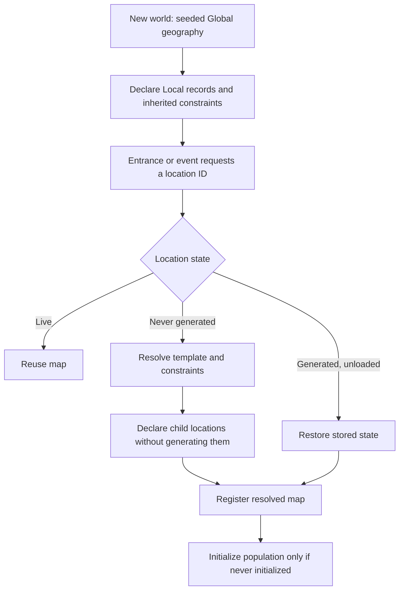

# Current hierarchical generation
Updated: 2026-09-12
Checkpoint: [World Foundation]+[Locations]+[Registry]

This describes **World Foundation/main.tscn**. Earlier scenes retain their earlier generators. The source architecture remains [Hierarchical_World_Gen.md](../../Design/Hierarchical_World_Gen.md).

## Resolution flow

`location_world.gd` owns the catalogue and map cache. Each record contains its parent, child IDs, template, role, label, generation seed, constraints and generated flag. A new run has a unique world identity; its location addresses combine that identity with stable ancestry-based IDs. Seeded terrain/content can repeat across runs without making those runs the same save.

The common resolver uses the destination ID. Entrance labels and kinds describe travel/UI; a Return link does not need enough information to generate a parent. Once generated, stored map state is authoritative. Missing stored data refuses restoration rather than silently rerolling a visited location.

## Global and Local

Global retains the established 80×42 axial grid, polar limits, east–west wrap, biome classification and river service. New-world land masks now come from `topology_generator.gd`: 2–7 randomly placed, rotated, differently proportioned influence fields, cylindrical noise, coordinate distortion and a seeded 26–53% land budget. Connected components receive continent IDs; islands are allowed. The starting cell is a dry Plains cell on the largest connected landmass. The old center-plus-four-diagonal-lobes template is no longer used by World Foundation.

Global declares Local records and boundary constraints without generating their playable maps. World identity, Global geometry and those declarations are automatically persisted before character creation. The same world is then used by its adventurer. Unfinished creation preserves the dice roll and placements across Continue.

This is procedural topology, not plate tectonics or a simulation of geological events. The 32-seed validation checks reproducibility, substantial starting land, land budgets, polar limits and changed silhouettes; it does not certify future encounter/resource balance. Older generator-one snapshots remain readable and retain their already resolved Global layout.

A Local has 30×20 through 45×30 cells, selected by its own deterministic stream. Its parent biome sets the regional interior. Water and terrain run first, inherited boundary surface constraints are applied, then internal rivers and required parent river routes. Spaced Dungeon, Town and Tower entrances follow. The existing lake-island Tower anchor and Return are preserved.

Every neighboring Global pair owns one canonical edge key, including across horizontal wrap. Both children receive the same five-sample water profile, dry terrain and river-presence contract. Six disjoint sections of each rectangular Local perimeter represent its six parent hex directions. The normalized profile is sampled onto each section, accommodating different Local sizes. Required river ports connect through the child edge graph to a central junction.

This is a **logical boundary contract for separate maps**. Rectangular children are not a seamless stitched geographic projection, and walking off a Local edge does not enter its neighbor. Existing interior rivers remain, and required routes use connected graph paths rather than a full drainage simulation. Boundary coherence is implemented; realistic watersheds, coastal blending and water art still need dedicated work.

## Templates and recursion

| Template | Initial enemies | Deferred child |
|---|---:|---|
| Local | 0 | Dungeon, Town, Tower |
| Dungeon | 1 | Dungeon Floor 2 |
| DungeonFloor | 1 | None |
| Town | 0 | Well |
| Well | 0 | Underground |
| Underground | 1 | None |
| Tower | 1 | Upper Tower |
| TowerFloor | 1 | None |
| Shrine | 0 | None |

Templates provide small playable layouts, population counts, allowed placement terrain and child declarations. Interiors carve accessible paths from Return to their child entrance. There is no resolver depth limit: the event API can place further template instances inside resolved or unresolved non-Global parents. Finite default content prevents automatic infinite expansion.

Map rendering retains the `POI` layer for interiors; the registry distinguishes POI and Submap roles. This reuses the current renderer without making layer names control hierarchy.

Population uses a separate location-seeded RNG for stats and equipment. Numeric actor/item IDs are allocated when objects are created, so their allocation order can differ between independent runs; generated content is visit-order-independent and identity remains fixed once created. Existing actor turns, inventory rules, perception and observed-exit pursuit remain authoritative.

## Events

`world.maps.request_poi(parent_id, template, requested_cell, label)` is the event boundary. Omit the position for seeded placement. It rejects unknown templates, Global parents, occupied entrance cells, walls, water and incompatible template terrain. Rejected requests do not change the registry or instance counter. An unresolved parent is staged; its generation commits only if placement succeeds.

Success declares a unique child record and adds a parent entrance. It does not generate the child until requested. Multiple Dungeons can coexist in one parent. This supplies the world-generation interface for future quests/events; it is not a quest scripting or faction system.

## Persistence and unloading

`persistent_actor_world.gd` captures a versioned binary Variant snapshot containing the world identity/seed, complete catalogue, every resolved map, initialization flags, all actors, ground items, item/actor counters, cooldowns, pending actions, pursuit memory, difficulty and turn count. Object deserialization is disabled; clocks are reconstructed explicitly.

Loading checks schema, record ancestry, map/entrance references, actor structure and positions, inventory IDs and occupancy before replacing the live simulation. Only the player's map (or Global for an unfinished character) is materialized immediately; other resolved states restore on demand. An active pursuer's map is loaded before its turn.

Explicit unloading writes a unique per-location archive before releasing the live map object. Actors and ground inventories remain in the simulation. After full-save loading, unmaterialized map-state dictionaries remain in memory until used; this is not yet a fully indexed disk-streaming store.

`autosave_journal.gd` writes compressed, checksummed, append-only transactions under `saves/autosaves/`. The first transaction contains the full world. Subsequent transactions contain changed actors, ground inventories, location records/maps and counters. Each completed transaction is flushed and closed before the action handler returns. Successful gameplay actions, turns, travel, event POIs, character setup and normal window close checkpoint automatically. Looking, previews and unchanged state do not produce duplicate transactions.

A location revision tracks structural generation/event changes. Incremental capture reuses immutable previous geography when that revision is unchanged, while checking loaded camera offsets separately. Future map-mutation services must advance the location revision; direct geometry edits outside the owning service are not an autosave API. Runtime actor changes continue through the shared action services. Full structural validation runs at initial checkpoint and load; repeated trusted actor actions do not revalidate the entire catalogue.

Continue replays completed journal entries. A truncated or checksum-failed tail restores the last complete checkpoint; a file without any complete initial checkpoint is skipped in favor of an earlier valid save. Resuming begins a new self-contained journal on the next checkpoint, preserving its predecessor. Save failures are shown in the UI; a normal close does not silently quit after a failed checkpoint. This does not promise recovery of an in-flight action or protection from arbitrary hardware/disk failure.

Manual extra snapshots still create unique `.world` files under `saves/`, and legacy generator-one saves remain supported. This Workshop implementation writes into the project and is intended for editor/F6 use. Tests use separate autosave directories under `tests/saves/`. Files are retained rather than rotated/deleted. Journals replay sequentially and have no compaction yet; export-ready storage and large-history indexing remain future work. Unload archives are separate from automatic full-world persistence.
